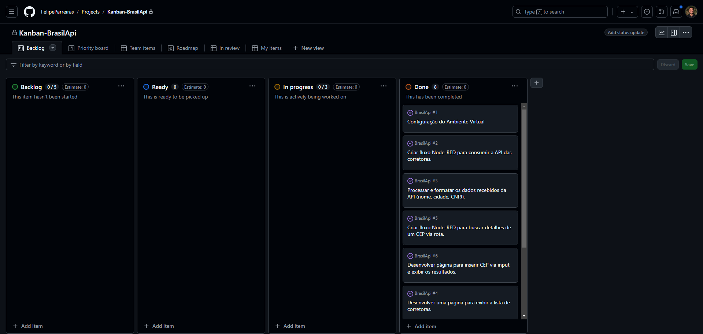

# BrasilApi

# Projeto de estudos dedicado à utilização do Node-RED, BrasilAPI e React

## Autor
- Felipe Luiz Parreiras Lima

## Como Rodar o Projeto:

- Instale as dependências do projeto:
```bash
npm install
```
- Inicie o Projeto:
```bash
npm run dev
```
- Instale o Node-RED (**Caso não esteja instalado**):
```bash
npm install -g --unsafe-perm node-red
```
- Inicie o Node-RED:
```bash
node-red
```
- Procure o arquivo [flows.json](Node-Red_Files) e faça a importação do arquivo na porta [http://localhost:1880](http://localhost:1880)

## Sobre o Projeto:
Este projeto foi desenvolvido como parte de um estudo sobre as tecnologias **Node-RED, React.js e a BrasilAPI**. O objetivo é explorar a integração dessas ferramentas e criar funcionalidades que exemplifiquem seu uso em aplicações web.

O projeto implementa duas principais funcionalidades:

- **Broker Catalog:** uma listagem de corretoras brasileiras, exibindo o nome, estado e CNPJ de cada corretora no seguinte formato: Nome da Corretora - Estado / CNPJ.

- **Zip Code Searcher:** uma ferramenta de busca que, ao inserir um código postal, exibe as informações correspondentes, como CEP, estado, cidade, bairro e logradouro.

## Metodologia:
Para a realização deste projeto, foi utilizada a metodologia Kanban. Foi criado um quadro onde as tarefas foram organizadas em Sprints e Artefatos, conforme visto na imagem abaixo:


