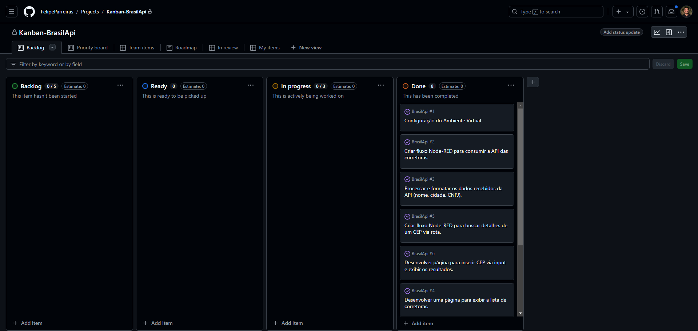

# BrasilApi
# Projeto de estudos dedicados a utilização do Node-Red, BrasilApi e React
## Autor
- Felipe Luiz Parreiras Lima
## Sobre o Projeto:
Este projeto foi desenvolvido como parte de um estudo sobre as tecnologias **Node-RED, React.js e a BrasilAPI**. O objetivo é explorar a integração dessas ferramentas e criar funcionalidades que exemplifiquem seu uso em aplicações web.

O projeto implementa duas principais funcionalidades:

- **Broker Catalog:** uma listagem de corretoras brasileiras, exibindo o nome, estado e CNPJ de cada corretora no seguinte formato: Nome da Corretora - Estado / CNPJ.

- **Zip Code Searcher:** uma ferramenta de busca que, ao inserir um código postal, exibe as informações correspondentes, como CEP, estado, cidade, bairro e logradouro.

## Metodologia:
Para a realizacao deste projeto foi utilizada a metodologia Kamban, com isso utilizei uma quadro onde foram separadas em Sprints e Artefatos, como visto na imagem a baixo:

